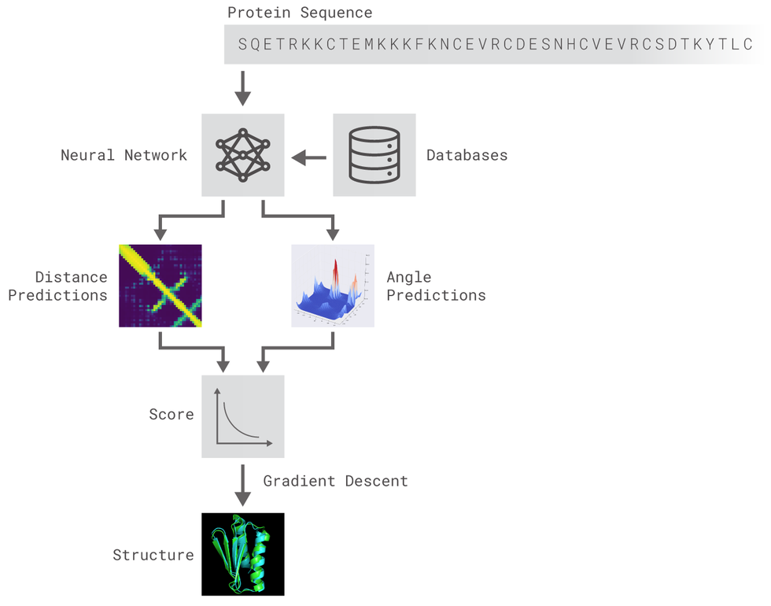

# Awesome Structural BioInformatics 

*A curated list of awesome structural bioinformatics frameworks, libraries, software and resources.*

> So let it not look strange if I claim that it is much easier to explain the movement of the giant celestial bodies than to interpret in mechanical terms the origination of just a single caterpillar or a tiny grass. - Immanuel Kant, *Natural History and the Theory of Heaven*, 1755

Books on Cheminformatics, [Bioinformatics](http://thegrantlab.org/teaching/material/Intro_Structural_Bioinformatics_Barry.pdf), Quantum Chemistry strangle the subject to sleep 😴 and command a wild price 🤑 for the naps they induce.

Want a better way to learn than some random repo on github? 

Spend 4-12 years of your life and hundreds of thousands of dollars chasing a paper with a stamp on it 🥇.

Or feed yourself 🍼.

Information should be cheap, fast enjoyable, silly, shared, disproven, contested, and most of all free.

Knowledge hodlers, and innovation stifflers are boring and old. This is for the young of mind and young of spirit 🚼 that love to dock & fold. 

# Folding

 > Structure-function relationships are the fundamental object of knowledge in protein chemistry; they allow us to rationally design drugs, engineer proteins with new functions, and understand why mutations cause disease. [- On The Origin of Proteins](https://www.chemistryworld.com/features/on-the-origin-of-proteins/3004719.article)

> There is now a testable explanation for how a protein can fold so quickly: A protein solves its large global optimization problem as a series of smaller local optimization problems, growing and assembling the native structure from peptide fragments, local structures first. [- The Protein Folding Problem](https://www.ncbi.nlm.nih.gov/pmc/articles/PMC2443096/)

The protein folding problem consists of three closely related puzzles:
* (a) What is the folding code? 
* (b) What is the folding mechanism?
* (c) Can we predict the native structure of a protein from its amino acid sequence? [source](https://www.ncbi.nlm.nih.gov/pmc/articles/PMC2443096/)

## Data Sources

[CATH/Gene3D](https://www.cathdb.info/) - 151 Million Protein Domains Classified into 5,481 Superfamilies

[NCBI Conserved Domains Database](https://www.ncbi.nlm.nih.gov/Structure/cdd/wrpsb.cgi) - resource for the annotation of functional units in proteins

[Protein Data Bank](https://www.rcsb.org/)

[Scop 2](https://scop.mrc-lmb.cam.ac.uk/) - Structural Classification of Proteins

[UniProt](https://www.uniprot.org/) -  comprehensive, high-quality and freely accessible resource of protein sequence and functional information.

[Fold@Home](https://foldingathome.org/about/)

## Deep Learning Protein Folding

### [AlphaFold 14](https://www.predictioncenter.org/casp14/doc/presentations/2020_12_01_TS_predictor_AlphaFold2.pdf)

  * [:book: Paper](https://www.nature.com/articles/s41586-019-1923-7.epdf?author_access_token=Z_KaZKDqtKzbE7Wd5HtwI9RgN0jAjWel9jnR3ZoTv0MCcgAwHMgRx9mvLjNQdB2TlQQaa7l420UCtGo8vYQ39gg8lFWR9mAZtvsN_1PrccXfIbc6e-tGSgazNL_XdtQzn1PHfy21qdcxV7Pw-k3htw%3D%3D)
  * [:newspaper: article](https://deepmind.com/blog/article/AlphaFold-Using-AI-for-scientific-discovery)
  * [AlpahFold 14 Results Discussion](https://dasher.wustl.edu/bio5357/discussion/oxford-alphafold2.pdf)
  * [What AlphaFold means for Structural BioInformatics](https://ammiellewb.medium.com/what-alphafold-means-for-structural-bioinformatics-78117adb7d11)
  * [AlphaFold 2 Explained](https://youtu.be/B9PL__gVxLI) - Yanick Video
  * [Illustrated Transformer](kjalammar.github.io/illustrated-transformer/)
  * [Transformers from Scratch](http://peterbloem.nl/blog/transformers)

### [AlphaFold 13](https://www.predictioncenter.org/CASP13/doc/presentations/Pred_CASP13-Structure-AlphaFold-Jumper.pdf)

  * [:floppy_disk: Code](https://github.com/deepmind/deepmind-research/tree/master/alphafold_casp13)
  * [:floppy_disk: Code](https://github.com/dellacortelab/prospr) - Prospr - Open Source Implementation
  * [:book: Prospr Paper](https://www.biorxiv.org/content/10.1101/830273v1) 
  * [AlphaFold @ Casp13: What Just Happened?](https://moalquraishi.wordpress.com/2018/12/09/alphafold-casp13-what-just-happened/) 

### [MiniFold](https://github.com/hypnopump/MiniFold) - Open Source toy example of AlphaFold 13 algorithm 

> The DeepMind work presented @ CASP was not a technological breakthrough (they did not invent any new type of AI) but an engineering one: they applied well-known AI algorithms to a problem along with lots of data and computing power and found a great solution through model design, feature engineering, model ensembling and so on...

> Based on the premise exposed before, the aim of this project is to build a model suitable for protein 3D structure prediction inspired by AlphaFold and many other AI solutions that may appear and achieve SOTA results.

> Two different residual neural networks (ResNets) are used to predict angles between adjacent aminoacids (AAs) and distance between every pair of AAs of a protein. For distance prediction a 2D Resnet was used while for angles prediction a 1D Resnet was used.

### PDNet

> As deep learning algorithms drive the progress in protein structure prediction, a lot remains to be studied at this merging superhighway of deep learning and protein structure prediction. Recent findings show that inter-residue distance prediction, a more granular version of the well-known contact prediction problem, is a key to predicting accurate models. However, deep learning methods that predict these distances are still in the early stages of their development. To advance these methods and develop other novel methods, a need exists for a small and representative dataset packaged for faster development and testing. In this work, we introduce protein distance net (PDNET), a framework that consists of one such representative dataset along with the scripts for training and testing deep learning methods. The framework also includes all the scripts that were used to curate the dataset, and generate the input features and distance maps.

[:desktop: Github](https://github.com/ba-lab/pdnet/)

[:book: Paper](https://www.nature.com/articles/s41598-020-70181-0) 

[:vhs: YouTube](https://youtu.be/uAIuA1O7iE8)

# Docking

"Docking is a method which predicts the prefered orientation of one molecule to a second when bound to each other to form a stable complex. Knoweldge of the prefered orientation in turn may be used to predict the strength of association or binding affinity between two molecules using scoring functions."

* Pose - A conformation of the receptor and ligand molecules showing some intermolecular interactions (which may include hydrogen bonds as well as hydrophobic contacts
* Posings - The process of searching for a pose in which there are favorable interactions between the receptor and the ligand molecules.
* Scoring - The process of evaluating a particular pose using a number of descriptive features like number of intermolecular interactions including hydrogen bonds and hydrophobic contacts.

The primary factors that lead to a successful docking are: 

One of the first appearances of Molecular Docking is said to have been 1982's 

## [A Geometric Approach to MacroMolecule Ligand Interactions](https://www.sciencedirect.com/science/article/abs/pii/002228368290153X#:~:text=A%20geometric%20approach%20to%20macromolecule%2Dligand%20interactions%E2%98%86&text=Algorithms%20are%20presented%20that%20examine,sites%20on%20a%20macromolecular%20surface.)

They tell us Molecular Docking = "To position two molecules so that they interact favorably with one another..."

How???

> Our approach is to reduce the number of degrees of freedom using simplifying
assumptions that still retain some correspondence to a situation of biochemical
interest. Specifically, we treat the geometric (hard sphere) interactions of two rigid
bodies, where one body (the “receptor”) contains “pockets” or “grooves” that form
binding sites for the second object, which we will call the “ligand”. Our goal is to fix
the six degrees of freedom (3 translations and 3 orientations) that determine the
best relative positions of the two objects.

---

> A common approach to docking combines a scoring function with an optimization algorithm. The scoring function quantifies the favorability of the protein-ligand interactions in a single pose, whichcan be conceptualized as a point in a continuous conformation space. A stochastic global optimization algorithm is used to explore and sample this conformation space. Then, local optimization is employed on the sampled points, usually by iteratively adjusting the pose in search of a local extremum of the scoring function. Ideally, the scoring function is differentiable to support efficient gradient-based optimization.

> The information obtained from the docking technique can be used to suggest the binding energy, free energy and stability of complexes. At present, docking technique is utilized to predict the tentative binding parameters of ligand-receptor complex beforehand.

> There are various databases available, which offer information on small ligand molecules such as CSD (Cambridge Structural Database), ACD (Available Chemical Directory), MDDR (MDL Drug Data Report) and NCI (National Cancer Institute Database).

## Scoring Function 

 There are two common approaches to building a score function: 
* **potentials of mean force**
    * often called statistics- or Boltzmann-based force fields
    * measuring distance as a reflection of statistical tendencies within proteins
    * . One takes a large set of proteins, collects statistics and converts them to a score function. One then expects this function to work well for proteins not included in its parameterisation. 
* **an optimization calculation**
   * select underlying basis function 
      * quasi-Lennard-Jones 
      * various sigmoidal functions 
   * We can say that the correct structure is whatever is given in the protein data bank, but unfortunately, there is almost an infinity of incorrect structures for a sequence and one would like the score function to penalize all of them
  *  One way to encode this idea is to adopt a statistical approach and try to consider the distribution of incorrect structures
 [source](http://web.stanford.edu/class/cs273/refs/torda_chapter_proteomics.pdf)

Allowing gaps and insertions at any position and of any length leads to a combinatorial explosion of possibilities. The calculation can be made tractable by restricting the search space and forbidding gaps except in recognised loops in template structures.

There is a score function and a fast method for producing the best possible sequence to structure alignments and thus the best models possible. Unfortunately, the problem is still not solved

##  Tools

*Tools for exploring how two or more molecular structures fit together*

[AutoDock](http://autodock.scripps.edu/) - suite of automated docking tools designed to predict how small molecules bind to a receptor of known 3D structure

[AutoDock Vina](http://vina.scripps.edu/) - significantly improves the average accuracy of the binding mode predictions compared to AutoDock

* [:book: Paper](https://www.ncbi.nlm.nih.gov/pmc/articles/PMC3041641/)

[Gnina](https://github.com/gnina/gnina) - deep learning framework for molecular docking -inside deepchem (/dock/pose_generation.py)

[GOMoDo](https://gomodo.grs.kfa-juelich.de/php/about.php) - GPCR online modeling and docking server

[Smina](https://github.com/mwojcikowski/smina) used for minimization (local_only) as opposed to of docking, makes Vina much easer to use and 10-20x faster. Docking performance is about the same since partial charge calculation and file i/o isn't such a big part of the performance.

# Virtual Screening

Virtual screening = target structure scored with molecules from database to identify potential activies. 

## Useful References

(2020) [High-Throughput Docking Using Quantum Mechanical Scoring](https://www.frontiersin.org/articles/10.3389/fchem.2020.00246/full)

(2020) [Deep Learning Methods in Protein Structure Prediction](https://www.sciencedirect.com/science/article/pii/S2001037019304441)

(2019)[From Machine Learning to Deep Learning: Advances in scoring functions for protein-ligand docking](https://onlinelibrary.wiley.com/doi/abs/10.1002/wcms.1429)

(2019) [The Unreasonable Effectiveness of Convolutional Neural Networks in Population Genetic Inference, Molecular Biology and Evolution](https://doi.org/10.1093/molbev/msy224)

(2018) [DeepFam: deep learning based alignment-free method for protein family modeling and prediction](https://doi.org/10.1093/bioinformatics/bty275)

(2018) [Derivative-free neural network for optimizing the scoring functions associated with dynamic programming of pairwise-profile alignment](https://doi.org/10.1186/s13015-018-0123-6)

(2017) [Protein-Ligand Scoring with CNN](https://pubs.acs.org/doi/10.1021/acs.jcim.6b00740)

(2017) [Quantum-chemical insights from deep tensor neural networks](https://www.nature.com/articles/ncomms13890)

(2014) [MRFalign: Protein Homology Detection through Alignment of Markov Random Fields](https://journals.plos.org/ploscompbiol/article?id=10.1371/journal.pcbi.1003500)

(2012) [Molecular Docking: A powerful approach for structure-based drug discovery](https://www.ncbi.nlm.nih.gov/pmc/articles/PMC3151162/#:~:text=The%20docking%20process%20involves%20two,assessment%20of%20the%20binding%20affinity.)

(2011) [The structural basis for agonist and partial agonist action on a β(1)-adrenergic receptor](https://pubmed.ncbi.nlm.nih.gov/21228877/)

(2010) [AutoDock Vina: improving the speed and accuracy of docking with a new scoring function, efficient optimization and multithreading](https://www.ncbi.nlm.nih.gov/pmc/articles/PMC3041641/)

(2009) [Amphipol-Assisted in Vitro Folding of G Protein-Coupled Receptors](https://pubs.acs.org/doi/10.1021/bi801729z)

(2005) [GPCR Folding and Maturation](https://link.springer.com/chapter/10.1007/978-1-59259-919-6_3) from [The G Protein-Coupled Receptors Handbook](https://link.springer.com/book/10.1007/978-1-59259-919-6)

(1982) [A Geometric Approach to MacroMolecule Ligand Interactions](https://www.sciencedirect.com/science/article/abs/pii/002228368290153X#:~:text=A%20geometric%20approach%20to%20macromolecule%2Dligand%20interactions%E2%98%86&text=Algorithms%20are%20presented%20that%20examine,sites%20on%20a%20macromolecular%20surface.)

## Other Free Books You Should Read Instead of This Repo

[Chemisty 2E](https://openstax.org/details/books/chemistry-2e) - :atom: Equivalent to 201 & 202 Level Chemistry Book

[Chemistry: Atoms First 2E](https://openstax.org/details/books/chemistry-atoms-first-2e) :atom: Fork of 2E but not with more Atoms!!!!

[Biology 2E](https://openstax.org/details/books/biology-2e) 👽 Like Chemistry 2E but Biology 

[Artificial Intelligence: A Modern Approach]( https://github.com/aimacode/aima-python) 🤖 The Gospel of Machine Learning

[Neural Networks and Deep Learning](http://neuralnetworksanddeeplearning.com/) 🤖 Michael Nielsen writes another masterpiece - About Deep Learning - if you are into that sort of thing. 

[Reinforcement Learning](http://incompleteideas.net/book/RLbook2020.pdf) 🤖  The only book you need on the subject 

[Pattern Recognition and Machine Learning](https://www.microsoft.com/en-us/research/uploads/prod/2006/01/Bishop-Pattern-Recognition-and-Machine-Learning-2006.pdf) 🤖 Another classic banger
