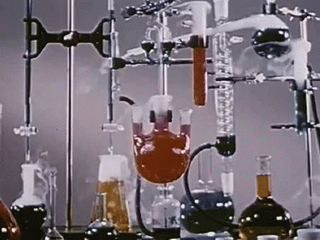

# Awesome Protein Folding

## Molecular Docking Tools

* Tools for exploring how two or more molecular structures fit together*

[AutoDock](http://autodock.scripps.edu/)

[AutoDock Vina](http://vina.scripps.edu/)

[Gnina](https://github.com/gnina/gnina) - deep learning framework for molecular docking -inside deepchem (/dock/pose_generation.py)

[GOMoDo](https://gomodo.grs.kfa-juelich.de/php/about.php) - GPCR online modeling and docking server

[Smina](https://github.com/mwojcikowski/smina)

Want a better way to learn than some random repo on github? 

Spend 4-12 years of your life and hundreds of thousands of dollars chasing a paper with a stamp on it 🥇.

Or feed yourself 🍼.

## Why Awesome Protein Folding? 

Books on Cheminformatics, Bioinformatics, Quantum Chemistry strangle the subject to sleep 😴 and command a wild price 🤑 for the naps they induce. 

Knoweldge should be cheap, fast enjoyable, silly, shared, disproven, contested, and most of all free. This book combats knowledge hodlers, and innovation stifflers by not being boring and old. This is for the young of mind and young of spirit 🚼 that love to fold. 

## Other Free Books You Should Read Instead of This Repo

[Chemisty 2E](https://openstax.org/details/books/chemistry-2e) - :atom: Equivalent to 201 & 202 Level Chemistry Book

[Chemistry: Atoms First 2E](https://openstax.org/details/books/chemistry-atoms-first-2e) :atom: Fork of 2E but not with more Atoms!!!!

[Biology 2E](https://openstax.org/details/books/biology-2e) 👽 Like Chemistry 2E but Biology 

[Artificial Intelligence: A Modern Approach]( https://github.com/aimacode/aima-python) 🤖 The Gospel of Machine Learning

[Neural Networks and Deep Learning](http://neuralnetworksanddeeplearning.com/) 🤖 Michael Nielsen writes another masterpiece - About Deep Learning - if you are into that sort of thing. 

[Reinforcement Learning](http://incompleteideas.net/book/RLbook2020.pdf) 🤖  The only book you need on the subject 

[Pattern Recognition and Machine Learning](https://www.microsoft.com/en-us/research/uploads/prod/2006/01/Bishop-Pattern-Recognition-and-Machine-Learning-2006.pdf) 🤖 Another classic banger

## Why Should You Care

At their core, Crick and thus *Prometheus* are taking about evolution at the molecular level. 

 > Structure-function relationships are the fundamental object of knowledge in protein chemistry; they allow us to rationally design drugs, engineer proteins with new functions, and understand why mutations cause disease. [source](https://www.chemistryworld.com/features/on-the-origin-of-proteins/3004719.article)

## Scoring Function 

 There are two common approaches to building a score function: 
* **potentials of mean force**
    * often called statistics- or Boltzmann-based force fields
    * measuring distance as a reflection of statistical tendencies within proteins
    * . One takes a large set of proteins, collects statistics and converts them to a score function. One then expects this function to work well for proteins not included in its parameterisation. 
* **an optimization calculation**
   * select underlying basis function 
      * quasi-Lennard-Jones 
      * various sigmoidal functions 
   * We can say that the correct structure is whatever is given in the protein data bank, but unfortunately, there is almost an infinity of incorrect structures for a sequence and one would like the score function to penalize all of them
  *  One way to encode this idea is to adopt a statistical approach and try to consider the distribution of incorrect structures
 [source](http://web.stanford.edu/class/cs273/refs/torda_chapter_proteomics.pdf)

Allowing gaps and insertions at any position and of any length leads to a combinatorial explosion of possibilities. The calculation can be made tractable by restricting the search space and forbidding gaps except in recognised loops in template structures.

There is a score function and a fast method for producing the best possible sequence to structure alignments and thus the best models possible. Unfortunately, the problem is still not solved

### Probability 

### Tools 

[AlphaFold 14](https://www.predictioncenter.org/casp14/doc/presentations/2020_12_01_TS_predictor_AlphaFold2.pdf)
  * [:book: Paper](https://www.nature.com/articles/s41586-019-1923-7.epdf?author_access_token=Z_KaZKDqtKzbE7Wd5HtwI9RgN0jAjWel9jnR3ZoTv0MCcgAwHMgRx9mvLjNQdB2TlQQaa7l420UCtGo8vYQ39gg8lFWR9mAZtvsN_1PrccXfIbc6e-tGSgazNL_XdtQzn1PHfy21qdcxV7Pw-k3htw%3D%3D)
  * [:newspaper: article](https://deepmind.com/blog/article/AlphaFold-Using-AI-for-scientific-discovery)
  * [AlpahFold 14 Results Discussion](https://dasher.wustl.edu/bio5357/discussion/oxford-alphafold2.pdf)
  * [What AlphaFold means for Structural BioInformatics](https://ammiellewb.medium.com/what-alphafold-means-for-structural-bioinformatics-78117adb7d11)
  * [AlphaFold 2 Explained](https://youtu.be/B9PL__gVxLI) - Yanick Video
  * [Illustrated Transformer](kjalammar.github.io/illustrated-transformer/)
  * [Transformers from Scratch](http://peterbloem.nl/blog/transformers)

AlphaFold 13
  * [:floppy_disk: Code](https://github.com/deepmind/deepmind-research/tree/master/alphafold_casp13)
  * [:floppy_disk: Code](https://github.com/dellacortelab/prospr) - Prospr - Open Source Implementation
  * [:book: Prospr Paper](https://www.biorxiv.org/content/10.1101/830273v1) 
  * [AlphaFold @ Casp13: What Just Happened?](https://moalquraishi.wordpress.com/2018/12/09/alphafold-casp13-what-just-happened/) 

[MiniFold](https://github.com/hypnopump/MiniFold)

### [DeepQMC/PauliNet](https://deepqmc.github.io/index.html)

Deep-learning quantum Monte Carlo for electrons in real space

[ :bookmark_tabs: Publication](https://arxiv.org/pdf/1909.08423.pdf): (2020) Deep-neural-network solution of the electronic Schrödinger equation

[:floppy_disk: Github](https://github.com/deepqmc/deepqmc)

### [FermiNet](https://deepmind.com/blog/article/FermiNet)

Implementation of the Fermionic Neural Network for ab-initio electronic structure calculations 

[ :bookmark_tabs: Publication](https://arxiv.org/abs/1909.02487): (2020) Ab-Initio Solution of the Many-Electron Schrödinger Equation with Deep Neural Networks

[ :floppy_disk: GitHub Code](https://github.com/deepmind/ferminet)

### [Hande](http://www.hande.org.uk/ent):

Highly parallel code for stochastic quantum chemistry. Can be used as standalone program or library from an existing quantum chemistry code.

[ :bookmark_tabs:  Publication](https://pubs.acs.org/doi/10.1021/acs.jctc.8b01217)

[ :floppy_disk: : GitHub](https://github.com/hande-qmc/hande)

### PDNet

> As deep learning algorithms drive the progress in protein structure prediction, a lot remains to be studied at this merging superhighway of deep learning and protein structure prediction. Recent findings show that inter-residue distance prediction, a more granular version of the well-known contact prediction problem, is a key to predicting accurate models. However, deep learning methods that predict these distances are still in the early stages of their development. To advance these methods and develop other novel methods, a need exists for a small and representative dataset packaged for faster development and testing. In this work, we introduce protein distance net (PDNET), a framework that consists of one such representative dataset along with the scripts for training and testing deep learning methods. The framework also includes all the scripts that were used to curate the dataset, and generate the input features and distance maps.

[:desktop: Github](https://github.com/ba-lab/pdnet/)

[:book: Paper](https://www.nature.com/articles/s41598-020-70181-0) 

[:vhs: YouTube](https://youtu.be/uAIuA1O7iE8)

### [PySCF](http://pyscf.org/) 

open-source collection of electronic structure modules powered by Python. The package aims to provide a simple, lightweight, and efficient platform for quantum chemistry calculations and methodology development.

[:bookmark_tabs: Publication](https://authors.library.caltech.edu/74078/1/1701.08223.pdf)

[:bookmark_tabs: Documentation](http://pyscf.org/pyscf/overview.html)

[:floppy_disk: Github](https://github.com/pyscf/pyscf)

[:floppy_disk: mpi4pyscf](https://github.com/pyscf/mpi4pyscf) - Message Passing Interface) parallelism

### [PSi4](https://psicode.org/)

suite of ab initio quantum chemistry programs designed for efficient, high-accuracy simulations of molecular properties

[:bookmark_tabs: Documentation](https://psicode.org/psi4manual/master/index.html)

[:floppy_disk: Github](https://github.com/psi4/psi4/)

### [QMCTorch](https://qmctorch.readthedocs.io/en/latest/)

Pytorch Implementation of Real Space Quantum Monte Carlo Simulations of Molecular Systems 

[:floppy_disk: Github](https://github.com/NLESC-JCER/QMCTorch)

### [RaptorX](http://raptorx.uchicago.edu/)

[Raptor Standalone Software](https://github.com/j3xugit/RaptorX-3DModeling)

> RaptorX employs a nonlinear scoring function to combine homologous information (i.e., sequence profile) and structure information in a very flexible way. When proteins under consideration have high-quality sequence profile, RaptorX counts more on profile information, otherwise on structure information to improve alignment accuracy.... Our probabilistic model uses a regression-tree-based nonlinear scoring function to measure the similarity between two proteins. A regression tree consists of a collection of rules to calculate the probability of an alignment. We predict the absolute quality of a pairwise sequence-template alignment using neural network and then use the predicted quality to rank all the templates for a specific target.  Our old RAPTOR program uses an SVM method to predict the number of correctly aligned positions in an alignment

### [trRosetta](https://yanglab.nankai.edu.cn/trRosetta/)

[BigDFT](https://bigdft.org/) - GitLab [Repo](https://gitlab.com/l_sim/bigdft-suite) -DFT code for ab-initio atomistic simulation; "Open source software for innovative research of materials and
macro-molecular systems at the nanoscale"

[CP2K](https://www.cp2k.org/) - Open Source Molecular Dynamics 

## Molecular Docking Tools 

[AutoDock](http://autodock.scripps.edu/)

[AutoDock Vina](http://vina.scripps.edu/)

[Smina](https://github.com/mwojcikowski/smina)

[Gnina](https://github.com/gnina/gnina) - deep learning framework for molecular docking -inside deepchem (/dock/pose_generation.py)

[GOMoDo](https://gomodo.grs.kfa-juelich.de/php/about.php) - GPCR online modeling and docking server

## Useful References

(2021) [The mutational landscape of human olfactory G protein-coupled receptors](https://www.ncbi.nlm.nih.gov/pmc/articles/PMC7866472/)

(2020) [Functions of olfactory receptors are decoded from their sequence](https://www.biorxiv.org/content/10.1101/2020.01.06.895540v1.full)

(2020) [Rapid online learning and robust recall in a neuromorphic olfactory circuit](https://arxiv.org/abs/1906.07067) - Paper from Intel's Neuromorphic Computing Lab

(2020) [High-Throughput Docking Using Quantum Mechanical Scoring](https://www.frontiersin.org/articles/10.3389/fchem.2020.00246/full)

(2020) [Predicting Human Olfactory Perception from Activities of Odorant Receptors](https://www.sciencedirect.com/science/article/pii/S2589004220305484)

(2020) [Deep Learning Methods in Protein Structure Prediction](https://www.sciencedirect.com/science/article/pii/S2001037019304441)

(2020) [Molecular chaperones and G protein-coupled receptor maturation and pharmacology](https://www.sciencedirect.com/science/article/abs/pii/S0303720720301623)

(2019) [Quantum Biology:
Can we explain olfaction using quantum phenomenon?](https://arxiv.org/pdf/1911.02529.pdf)

(2019) [Computational modeling of the olfactory receptor Olfr73 suggests a molecular basis for low potency of olfactory receptor-activating compounds](https://www.nature.com/articles/s42003-019-0384-8)

(2019) [Machine Learning for Scent: Learning Generalizable Perceptual Representations of Small Molecules](https://arxiv.org/pdf/1910.10685.pdf) 

(2019)[From Machine Learning to Deep Learning: Advances in scoring functions for protein-ligand docking](https://onlinelibrary.wiley.com/doi/abs/10.1002/wcms.1429)

(2019) [The Unreasonable Effectiveness of Convolutional Neural Networks in Population Genetic Inference, Molecular Biology and Evolution](https://doi.org/10.1093/molbev/msy224)

(2019) [Understanding Ligand Binding to G-Protein Coupled Receptors Using Multiscale Simulations](https://www.frontiersin.org/articles/10.3389/fmolb.2019.00029/full)

(2019) [Investigation of the binding between olfactory receptors and odorant molecules in C. elegans organism](https://www.sciencedirect.com/science/article/pii/S0301462219302881?via%3Dihub)

(2018) [Recent Advances in Structure-Based Drug Design Targeting Class A G Protein-Coupled Receptors Utilizing Crystal Structures and Computational Simulations](https://pubs.acs.org/doi/10.1021/acs.jmedchem.6b01453)

(2018) [Machine Learning in Human Olfactory Research](https://academic.oup.com/chemse/article/44/1/11/5145702)

(2018) [Structure–Function Relationships of Olfactory and Taste Receptors](https://academic.oup.com/chemse/article/43/2/81/4803207)

(2018) [DeepFam: deep learning based alignment-free method for protein family modeling and prediction](https://doi.org/10.1093/bioinformatics/bty275)

(2018) [Derivative-free neural network for optimizing the scoring functions associated with dynamic programming of pairwise-profile alignment](https://doi.org/10.1186/s13015-018-0123-6)

(2018) [A Quantum Biomimetic Electronic Nose Sensor](https://www.nature.com/articles/s41598-017-18346-2)

(2018) [Applications and Advances in Bioelectronic Noses for Odour Sensing](https://www.ncbi.nlm.nih.gov/pmc/articles/PMC5795383/)

(2018) [Protein- and Peptide-Based Biosensors in Artificial Olfaction](https://www.cell.com/trends/biotechnology/fulltext/S0167-7799(18)30195-1?rss=yes)

(2018) [Hippocampal projections to the anterior olfactory nucleus differentially convey spatiotemporal information during episodic odour memor](https://www.nature.com/articles/s41467-018-05131-6) - AD

(2018) [From Nose to Memory: The Involuntary Nature of Odor-evoked Autobiographical Memories in Alzheimer’s Disease](https://academic.oup.com/chemse/article/43/1/27/4443144) - AD

(2017) [Protein-Ligand Scoring with CNN](https://pubs.acs.org/doi/10.1021/acs.jcim.6b00740)

(2017) [Gain‐of‐function mutations in G‐protein–coupled receptor genes associated with human endocrine disorders](https://onlinelibrary.wiley.com/doi/abs/10.1111/cen.13496)

(2015) [Implausibility of the vibrational theory of olfaction](https://www.pnas.org/content/112/21/E2766)

(2014) [Chaperoning G Protein-Coupled Receptors: From Cell Biology to Therapeutics](https://www.ncbi.nlm.nih.gov/pmc/articles/PMC4105357/)

(2014) [A computational microscope focused on the sense of smell](https://www.sciencedirect.com/science/article/pii/S0300908414001497?via%3Dihub)

(2014) [MRFalign: Protein Homology Detection through Alignment of Markov Random Fields](https://journals.plos.org/ploscompbiol/article?id=10.1371/journal.pcbi.1003500)

(2014) [Crystal structure of a common GPCR-binding interface for G protein and arrestin](https://www.nature.com/articles/ncomms5801)

(2013) [The GPCR Network: a large-scale collaboration to determine human GPCR structure and function](https://www.nature.com/articles/nrd3859)

(2012) [Molecular Docking: A powerful approach for structure-based drug discovery](https://www.ncbi.nlm.nih.gov/pmc/articles/PMC3151162/#:~:text=The%20docking%20process%20involves%20two,assessment%20of%20the%20binding%20affinity.)

(2011) [Mimicking nature’s noses: From receptor deorphaning to olfactory biosensing](https://www.bio.fsu.edu/~dfadool/Troy4.pdf)

(2011) [The structural basis for agonist and partial agonist action on a β(1)-adrenergic receptor](https://pubmed.ncbi.nlm.nih.gov/21228877/)

(2009) [The structure and function of G-protein-coupled receptors](https://www.nature.com/articles/nature08144)

(2009) [Amphipol-Assisted in Vitro Folding of G Protein-Coupled Receptors](https://pubs.acs.org/doi/10.1021/bi801729z)

(2008) [Update on the olfactory receptor (OR) gene superfamily](https://www.ncbi.nlm.nih.gov/pmc/articles/PMC2752031/)

(2007) [G-protein coupled receptor structure](https://www.sciencedirect.com/science/article/pii/S0005273606003889?via%3Dihub)

(2005) [GPCR Folding and Maturation](https://link.springer.com/chapter/10.1007/978-1-59259-919-6_3) from [The G Protein-Coupled Receptors Handbook](https://link.springer.com/book/10.1007/978-1-59259-919-6)

(2003) [The human olfactory receptor gene family](https://www.pnas.org/content/101/8/2584) - Linda Buck

(1991) [A Novel Multigene Family May Encode Odorant Receptors: A Molecular Basis
for Odor Recognition ](https://www.cell.com/cell/pdf/0092-8674(91)90418-X.pdf?_returnURL=https%3A%2F%2Flinkinghub.elsevier.com%2Fretrieve%2Fpii%2F009286749190418X%3Fshowall%3Dtrue) - the Nobel prize winning paper
